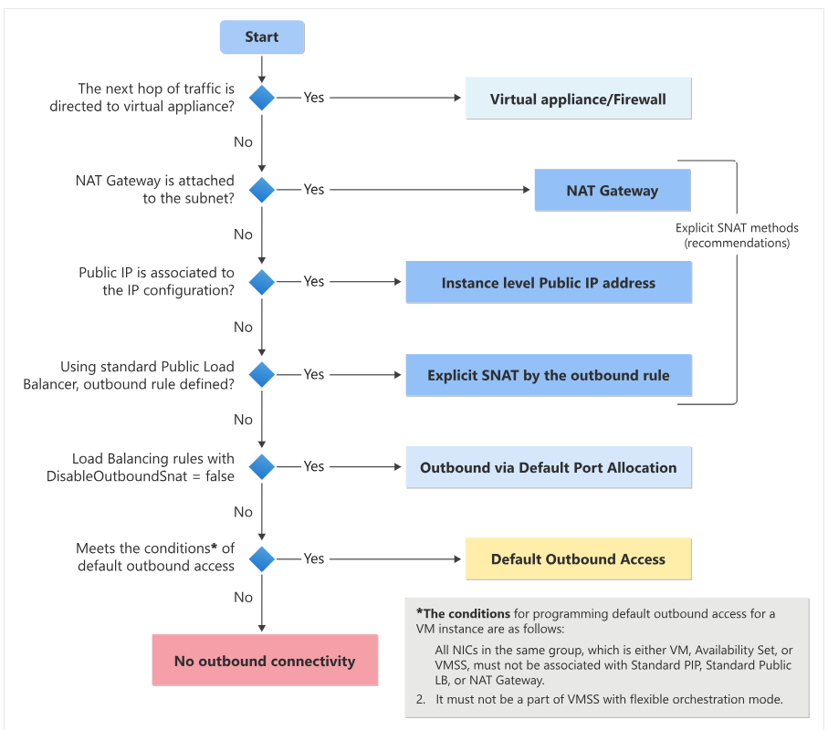

# Table of Contents
- [Desc](#desc)
- [Default outbound access](#default-outbound-access)
  - [Why?](#why)
- [Examples of explicit outbound connectivity for virtual machines](#examples-of-explicit-outbound-connectivity-for-virtual-machines)
- [Settings](#settings)
- [MFA](#mfa)
- [Last thing](#last-thing)
- [Reference](#reference)

## Desc
This time when I deploy AVD, I found something has changed comparing the first time I deploy AVD. Thus I just take a note for these changes.

## Default outbound access

On September 30, 2025, default outbound access for new deployments will be retired. For more information, see the official announcement.

### Why?
- Secure by default
   - It's not recommended to open a virtual network to the Internet by default using the zero trust network security principle.
  
- Explicit vs. implicit
   - It's recommended to have explicit methods of connectivity instead of implicit when granting access to resources in your virtual network.

- Loss of IP address
   - Customers don't own the default outbound access IP. This IP might change, and any dependency on it could cause issues in the future.
  
If you find outbound access issue after deploying AVD, you should use one of the explicit forms of connectivity discussed in the following section.

## Examples of explicit outbound connectivity for virtual machines
- Created within a subnet associated to a NAT gateway.

- Deployed in the backend pool of a standard load balancer with outbound rules defined.

- Deployed in the backend pool of a basic public load balancer.

- Virtual machines with public IP addresses explicitly associated to them.

## Settings
To enable access to Microsoft Entra joined VMs. your local PC must meet one of the following conditions:
- The local PC is Microsoft Entra joined to the same Microsoft Entra tenant as the session host
- The local PC is Microsoft Entra hybrid joined to the same Microsoft Entra tenant as the session host
- The local PC is running Windows 11 or Windows 10, version 2004 or later, and is Microsoft Entra registered to the same Microsoft Entra tenant as the session host
If you cannot access the VM via remote desktop. You need add the following setting to the Host Pool - RDP Properties - Advanced which is suggested by Microsoft Support.

    targetisaadjoined:i:1;

It will restrict entering user name and password credentials when signing in to the session host.

## MFA
If your want enable MFA, then you need to make extra settings to access AVD.
You should follow the document here. https://learn.microsoft.com/en-us/azure/virtual-desktop/azure-ad-joined-session-hosts#enforcing-microsoft-entra-multifactor-authentication-for-microsoft-entra-joined-session-vms

## Last thing
If you still cannot login the remote desktop, you can try unsubscribe and subscribe again.

## Reference
https://learn.microsoft.com/en-us/azure/virtual-network/ip-services/default-outbound-access#how-is-default-outbound-access-provided

https://learn.microsoft.com/en-us/azure/virtual-desktop/azure-ad-joined-session-hosts#connect-using-legacy-authentication-protocols