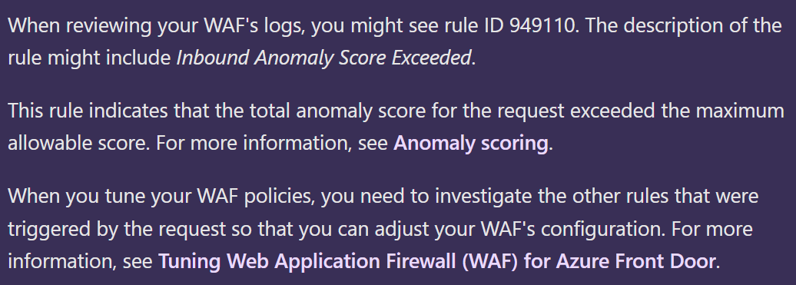
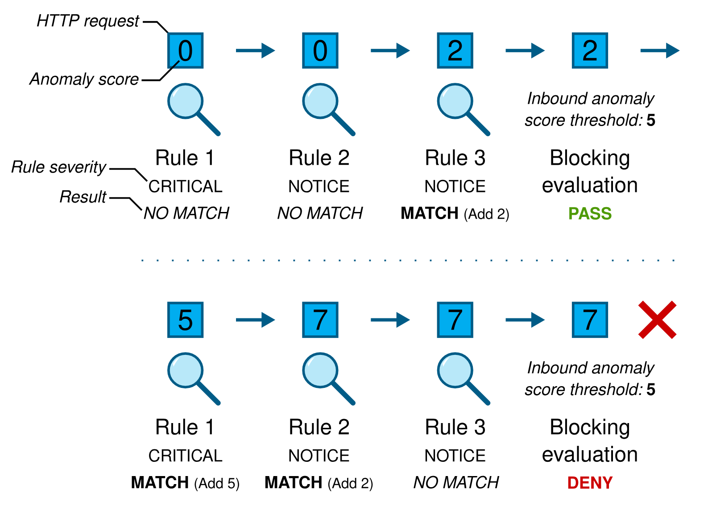

# Table of Contents
- [Desc](#desc)
- [Explain](#explain)
- [Anomaly Score?](#anomaly-score)
  - [Summary of Anomaly Scoring Mode](#summary-of-anomaly-scoring-mode)
- [Action](#action)
- [Reference](#reference)

## Desc
When you query Azure WAF logs, there might be blocked requsts due to rule 949110 - "BLOCKING-EVALUATION-949110". But on the portal, there are no related rule and explaination. 

## Explain
1. This rule means Inbound Anomaly Score Exceeded.
2. This is triggered when the anomaly threshold exceeds. This is in-turn caused by other rules that are hit which increase the anomaly score.

## Anomaly Score?
When you use DRS 2.0 or later, your WAF uses anomaly scoring. The OWASP rule sets define a severity for each rule: Critical, Error, Warning, or Notice. The severity affects a numeric value for the request, which is called the anomaly score. If a request accumulates an anomaly score of 5 or greater, the WAF takes action on the request.

| Severity Level | Default Anomaly Score | 
|----------|----------|
| CRITICAL   |  5   | 
| ERROR    | 4   | 
| WARNING    | 3   | 
| NOTICE    | 2   | 

### Summary of Anomaly Scoring Mode
1. Execute all request rules
2. Make a blocking decision using the inbound anomaly score threshold
3. Execute all response rules
4. Make a blocking decision using the outbound anomaly score threshold

## Action
1. Check the diagnostic logs and find the exact rules that are increasing the anomaly score.

    //根据transactionId_g查询对应的某一个请求匹配到的规则
    
    AzureDiagnostics 
    | where ResourceProvider == "MICROSOFT.NETWORK" and Category ==     "ApplicationGatewayFirewallLog"
    | where transactionId_g == "5b385db7-xxxx-xxxx-xxxx-32ff79b2f722"
2. Create the custom rules or exceptions to bypass the rules which increase the anomaly score.

## Reference
https://coreruleset.org/docs/concepts/anomaly_scoring/
https://learn.microsoft.com/en-us/azure/web-application-firewall/afds/waf-front-door-drs?tabs=drs21#anomaly-scoring-mode