# Table of Contents
- [Desc](#desc)
- [System Volume Information Directory](#system-volume-information-directory)
- [Clean](#clean)
  - [Delete Shadow Copies in System Volume Information](#delete-shadow-copies-in-system-volume-information)
  - [Clean Up Dedup ChunkStore in System Volume Information](#clean-up-dedup-chunkstore-in-system-volume-information)
- [Other Clean](#other-clean)
  - [Clean Up and Compress the WinSxS Folder on Windows](#clean-up-and-compress-the-winsxs-folder-on-windows)
    - [The fastest and easiest way to clear the Windows Component Store (the WinSxS folder) is to optimize the storage with the command:](#the-fastest-and-easiest-way-to-clear-the-windows-component-store-the-winsxs-folder-is-to-optimize-the-storage-with-the-command)
    - [A complete list of available features in Windows 10 image can be obtained using the command:](#a-complete-list-of-available-features-in-windows-10-image-can-be-obtained-using-the-command)
    - [Enable NTFS Compress on WinSxS Folder](#enable-ntfs-compress-on-winsxs-folder)
- [Reference](#reference)

## Desc
Windows automatically creates a hidden System Volume Information directory in the root of each connected NTFS drive (whether a local HDD/SSD drive or a removable USB drive) which could be very large. 
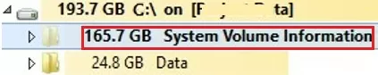

## System Volume Information Directory
To view this directory, enable Windows File Explorer to show system files (Options -> View -> uncheck Hide protected operation system files (Recommended)).

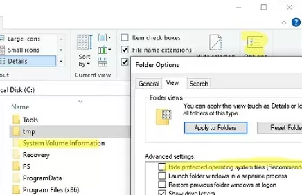

This directory can only be accessed by the NT AUTHORITY\SYSTEM account. Even the built-in Windows administrator won’t be able to open and view the contents of the System Volume Information directory. 
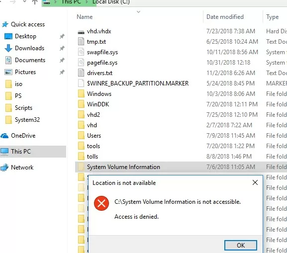

To open the System Volume Information directory in File Explorer, you can set yourself as the owner and grant NTFS permissions. 

    takeown /f "C:\System Volume information"
    icacls "C:\System Volume Information" /grant XXX\xxx:F
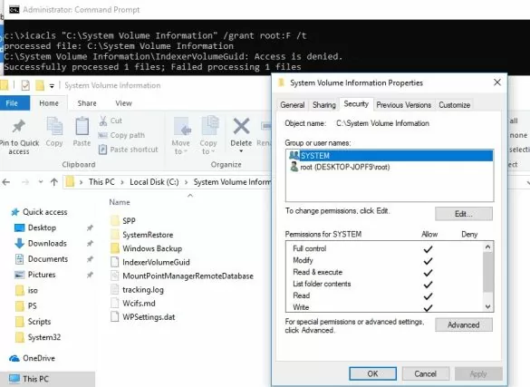

To restore the original permissions on the System Volume Information folder, run:

    icacls "C:\System Volume Information" /setowner "NT Authority\System"
    icacls "C:\System Volume Information" /remove XXX\xxx

Another way is use PsExec.exe tool.

    PsExec.exe -i -s powershell.exe
Lists the contents of a directory and sorts files by size:

    Get-ChildItem 'C:\System Volume Information\' -Force | Sort-Object Length -Descending| Select-Object Name, @{Name='Size(Mb)'; Expression={[int]($_.Length / 1MB)}}
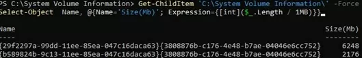

Total Size:

    (Get-ChildItem 'C:\System Volume Information\' -force | measure Length -s).sum / 1Gb

The following services that store their files in this folder.
1. WindowsImageBackup 
2. Indexing Service database used for fast file searching (including Outlook search)
3. Distributed Link Tracking Service database;
4. Drive snapshots created by Volume Shadow Copy service, which can be used to restore previous versions of files. 
5. NTFS disk quotas
6. Base and chunks of the Data Deduplication service;
7. DFS Replication database (dfsr.db)
8. Storage Service (StorSvc) WPSettings.dat file;
9. In the case of USB drives, this directory contains the IndexerVolumeGuid file, which stores the unique drive label that is used by Windows Search service
10. AppxProgramDataStaging, AppxStaging – backups of UWP Windows apps
11. CHKDSK log
12. AadRecoveryPasswordDelete and ClientRecoveryPasswordRotation – BitLocker directories used when storing the BitLocker recovery key in AD or Azure Entra ID.

*Note: Do not manually delete files in the System Volume Information directory, as it contains important information, including that required for system recovery.*

## Clean

### Delete Shadow Copies in System Volume Information
The shadow copies created by VSS are most often the cause of the large System Volume Information directory problem. 

    vssadmin list shadowstorage
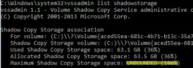

You can use the vssadmin command to reduce the disk quota for VSS copies to 2GB:

    vssadmin resize shadowstorage /on=c: /for=c: /maxsize=2GB
Or you can specify the percentage of available volume space:

    vssadmin resize shadowstorage /on=c: /for=c: /maxsize=10%

Display a list of available shadow copies for the C: system drive

    VSSADMIN list shadows /for=c:

To free up space on your drive, delete the oldest shadow copy:

    vssadmin delete shadows /for=C: /oldest

You can delete all VSS snapshots:

    vssadmin delete shadows /for=C: /all
You can also use System Protection in the Control Panel to change the automatic restore point settings. Run the command systempropertiesprotection, select your system drive, and click Configure.
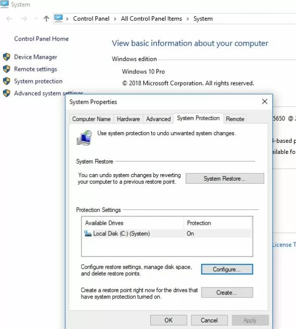

To reduce the size of the System Volume Information directory you can also:
1. Move the VSS snapshots to another NTFS drive (vssadmin add shadowstorage /for=c: /on=d: /maxsize=30%);
2. Disable or reconfigure the Windows File History feature;
3. Clean up system files using the built-in cleanmgr.exe tool (disk properties -> Disk Cleanup).
   
If you create system state backups using WSB (Windows Server Backup), you can delete all old copies of the system state by running the command:

    wbadmin delete systemstatebackup -keepversions:0

To quickly clean up old versions of VSS snapshots on Windows Server, use the diskshadow tool:

    DiskShadow
    Delete shadows OLDEST c:\
### Clean Up Dedup ChunkStore in System Volume Information
When the Windows Server deduplication service finds identical chunks (fragments) in files, it replaces them with a link to a unique chunk stored in the System Volume Information directory. These chunks are removed by a special GarbageCollection task that runs once a week.

To start the process of removing unused chunks immediately, run the PowerShell command:

    start-dedupjob -Volume C: -Type GarbageCollection

The next task checks the integrity of the remaining chunks:

    start-dedupjob -Volume C: -Type DataScrubbing

To monitor these tasks, use the cmdlet:

    Get-DedupJob

When the task is complete, any unused chunks are deleted from the System Volume Information directory.

## Other Clean
### Clean Up and Compress the WinSxS Folder on Windows
The C:\Windows\WinSxS directory is the repository of Windows components. This directory contains DLLs, binary, and XML files necessary for the installation and operation of various Windows roles or features. When installing the Windows updates (usually this happens every month), the new version of the updated component is installed on the system, while the old one is saved to the WinSxS folder (it is necessary to provide compatibility and make it possible to rollback to the previous versions of the components when you uninstall the Windows update).

You can find out the real size of the WinSxS folder on disk using the du tool from Sysinternals:

    du -v c:\windows\winSXS

You can also analyze the size of the component store (WinSxS folder) using the DISM command:

    Dism.exe /Online /Cleanup-Image /AnalyzeComponentStore
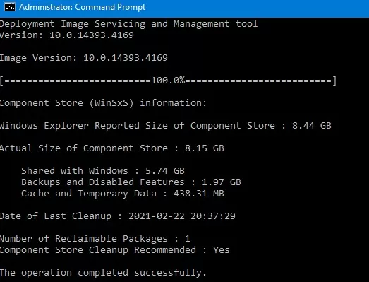

#### The fastest and easiest way to clear the Windows Component Store (the WinSxS folder) is to optimize the storage with the command:

    Dism.exe /Online /Cleanup-Image /StartComponentCleanup

The /StartComponentCleanup option has an additional /ResetBase option that allows you to remove all previous versions of components left after installing Windows updates. After that, you won’t be able to remove installed updates or Service Packs, and the Uninstall button will disappear from the Uninstall an Update Control Panel item). To clean up old versions of components, run:

    Dism.exe /Online /Cleanup-Image /StartComponentCleanup /ResetBase

You can also remove old update files using the “Disk Cleanup” wizard:
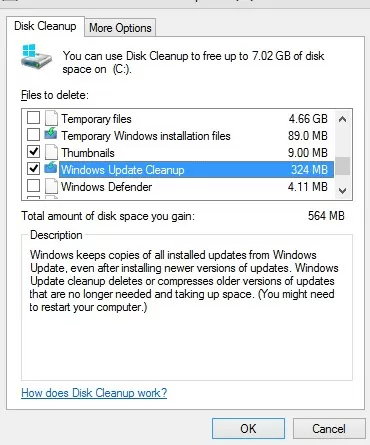

In addition, Windows 10/Windows Server 2016 Task Scheduler has a special automatic maintenance task that regularly optimizes and cleans up the WinSxS folder (same operation as DISM with StartComponentCleanup parameter). 
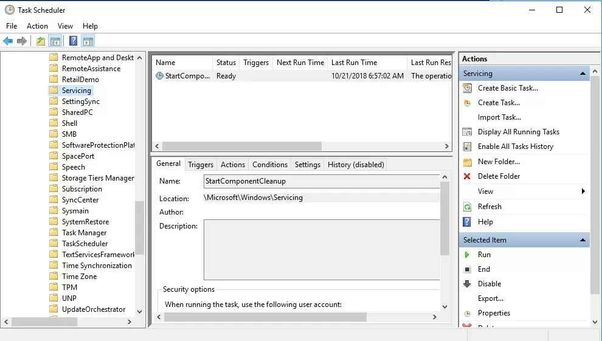

#### A complete list of available features in Windows 10 image can be obtained using the command:

    DISM.exe /Online /English /Get-Features /Format:Table
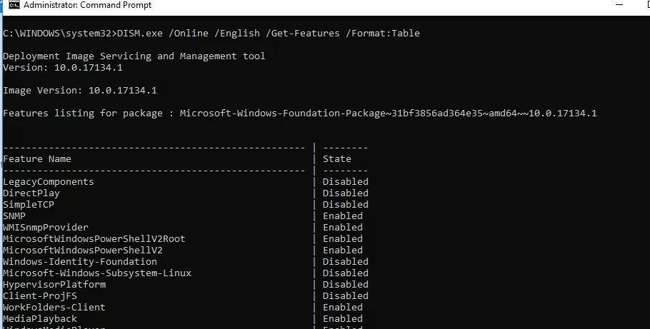

To remove, for example, the TelnetClient feature from the Windows image (from the WinSxS folder), run the command:

    DISM.exe /Online /Disable-Feature /Featurename:TelnetClient /Remove
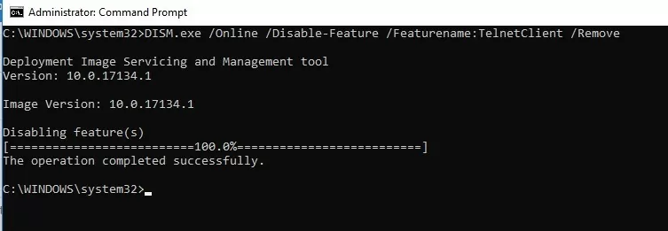
#### Enable NTFS Compress on WinSxS Folder
- Open the command prompt as administrator;
- Stop and disable Windows Installer and Windows Module Installer services:
- - sc stop msiserver
- - sc stop TrustedInstaller
- - sc config msiserver start= disabled
- - sc config TrustedInstaller start= disabled
- Let’s backup the Access Control Lists (ACLs) assigned to the files and folders in the WinSxS directory using the built-in icacls tool. A backup copy of an ACL is a plain text file that lists all files and directories and the NTFS permissions assigned to them (later this file will be needed to restore the original ACLs):
- - icacls "%WINDIR%\WinSxS" /save "%WINDIR%\WinSxS_NTFS.acl" /t
- Assign yourself as an owner of the WinSxS folder and all its subfolders:
- - takeown /f "%WINDIR%\WinSxS" /r
- Grant your account full control permissions on the WinSxS directory:
- - icacls "%WINDIR%\WinSxS" /grant "%USERDOMAIN%\%USERNAME%":(F) /t
- You can now compress files in the WinSxS directory using the compact command. Because some of the files can be used by Windows, you need to specify the /i option. Otherwise, compression will stop at the first locked file (in Windows 10, you can use more advanced LZX compression):
- - compact /s:"%WINDIR%\WinSxS" /c /a /i *
- Restore the owner of the WinSxS directory back to TrustedInstaller:
- - icacls "%WINDIR%\WinSxS" /setowner "NT SERVICE\TrustedInstaller" /t
- Restore the original ACLs for the WinSxS folder items using the ACL backup file you created earlier:
- - icacls "%WINDIR%" /restore "%WINDIR%\WinSxS_NTFS.acl"
- Restore the default startup type for the Windows Installer and Windows Module Installer services:
- - sc config msiserver start= demand
- - sc config TrustedInstaller start= demand
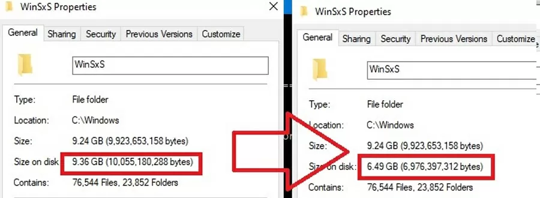

## Reference
https://woshub.com/how-to-clean-up-system-volume-information-folder/