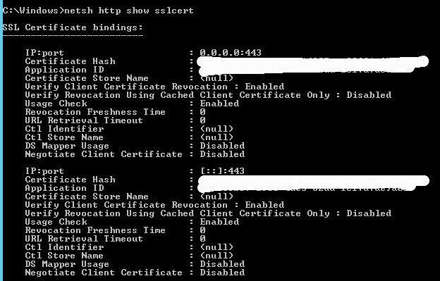

# Table of Contents
- [Desc](#desc)
- [Root Cause](#root-cause)
- [Fix](#fix)
- [Appendix](#appendix)
- [Cert requirement](#cert-requirement)
- [Reference](#reference)

## Desc
Sometimes when we update SSL Cert, reporting service manager won’t bind HTTPS to new certificate — “We are unable to create the certificate binding”. And Reporting Service Configuration Manager removes the HTTPS binding. We checked and the certificate is installed correctly.

## Root Cause
The old certificate is still there. You may use netsh to check.

    netsh http show sslcert

NETSH showing the old certificate bound

## Fix
Removing the certificate that was still bound to port 443

    netsh http delete sslcert ipport=[::]:443
    netsh http delete sslcert ipport=0.0.0.0:443

We could then bind the new certificate in Reporting Service Configuration Manager.

## Appendix
Use following cmd to list URL Reservations

    netsh http show urlacl

## Cert requirement
1. Certificate must be imported to local system's personal store.
2. Certificate must include a private key. Clients will use the public certificate to encrypt the data. Server need a corresponding private key to decrypt that data.
3. Certificate must include the hostname you're attempting to use in the DNS Name value

## Reference
https://businesswintelligence.com/content/60/troubleshooting-ssl-binding-ssrs
