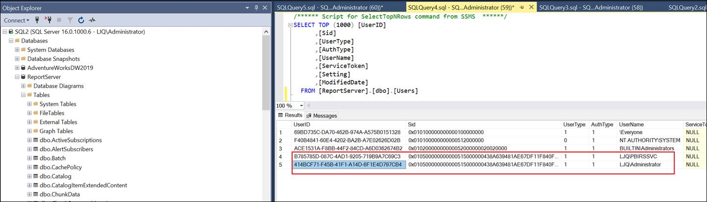
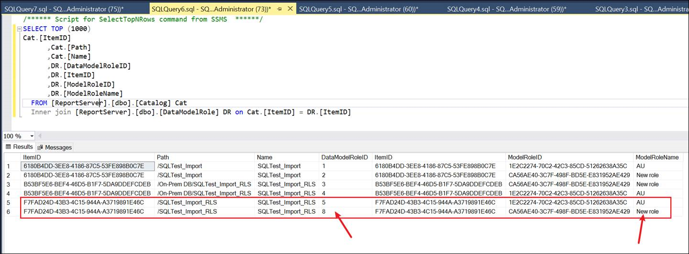

## Desc
### 用户删除了之前的RLS role，创建了新的role导致原先的role下的用户权限丢失。并且也没有基于AD组管理权限。

## Fix
### 在SQL Database里面通过如下脚本找到User对应的User ID
		SELECT TOP (1000) [UserID]
	      ,[Sid]
	      ,[UserType]
	      ,[AuthType]
	      ,[UserName]
	      ,[ServiceToken]
	      ,[Setting]
	      ,[ModifiedDate]
          FROM [ReportServer].[dbo].[Users]

### 找到报表名称对应的Role的DataModelRoleID
		SELECT TOP (1000) 
		Cat.[ItemID]
		      ,Cat.[Path]
		      ,Cat.[Name]
		         ,DR.[DataModelRoleID]
		      ,DR.[ItemID]
		      ,DR.[ModelRoleID]
		      ,DR.[ModelRoleName]
		  FROM [ReportServer].[dbo].[Catalog] Cat
            Inner join [ReportServer].[dbo].[DataModelRole] DR on Cat.[ItemID] = DR.[ItemID]

### 基于以上获取的UserID和DataModelRoleID，利用以下脚本即可成功添加该用户到该报表对应的Role下面
		exec AddUserDataModelRole @UserId='414BCF71-F45B-41F1-A14D-6F1E4D797CB4',@DataModelRoleId=8

