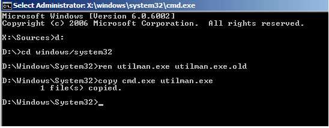
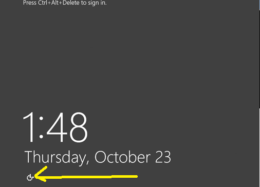
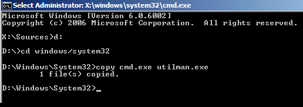

# Table of Contents
- [How to Reset A Forgotten Hyper-V Admin Password](#how-to-reset-a-forgotten-hyper-v-admin-password)
  - [What if I Am Using Windows Server Core? Windows core doesn't have GUI.](#what-if-i-am-using-windows-server-core-windows-core-doesnt-have-gui)
- [How Do I Protect My Server Against This Exploit?](#how-do-i-protect-my-server-against-this-exploit)
- [Reference](#reference)

## How to Reset A Forgotten Hyper-V Admin Password
Boot to a Windows CD. Browse to the repair section and open up the command line tool.
Type the following commands:

    d:
    cd Windows/system32
    Ren utilman.exe utilman.exe.old
    Copy cmd.exe utilman.exe

Reboot the host and start up normally. At the login screen click on the ease of access button in the lower left corner. A command prompt running as the system account will appear.

Type the following commands to change the local administrator password and enable the account if it’s disabled:

    Net user administrator newpassword
    Net user Administrator /active:yes
Type the following commands add another local administrator account

    Net user newadmin P@ssw0rd /add
    Net localgroup administrators newadmin /add
Revert the Ease of Access menu back to normal

    Copy utilman.exe.old utilman.exe
### What if I Am Using Windows Server Core? Windows core doesn't have GUI.
The Utilman.exe file is not included in the install of server core. So when you boot to the windows CD you can skip the part where you back up the utilman.exe executable.Type in the following commands

    D:
    Cd Windows/system32
    Copy cmd.exe utilman.exe

This will copy the command line executable and rename it as the utilman.exe file. When the host is rebooted, it will think the utilman.exe file exists and the Ease of Access button will respond by opening the command prompt when clicked on.

## How Do I Protect My Server Against This Exploit?
Set a BIOS password on the Hyper-V host and change the boot order to exclude CD-ROMs and USB drives. 

## Reference
<https://www.altaro.com/hyper-v/reset-forgotten-hyper-v-admin-password-windows-cd/>