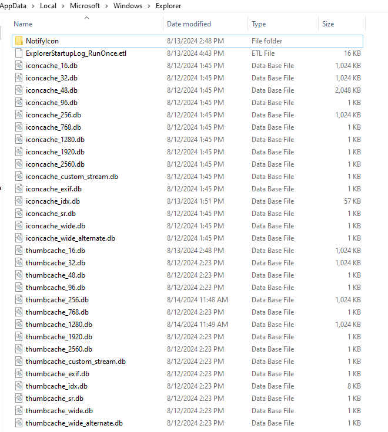

# Table of Contents
- [DESC](#desc)
- [Script](#script)
- [Note](#note)
  - [Thumbs.db](#thumbsdb)
  - [Office ~$ Files](#office--files)
- [Reference](#reference)

## DESC
Sometimes we want to get the file count and total size of a specific folder within a SPO library.

## Script
    #Parameters
    $SiteURL = "https://contoso.sharepoint.com/sites/company311"
    $FolderSiteRelativeURL = "Shared Documents/Test1"
    #Connect to PnP Online
    Connect-PnPOnline -Url $SiteURL -Interactive

    #Get the folder
    $Folder = Get-PnPFolder -Url $FolderSiteRelativeURL -Includes ListItemAllFields

    #Get the total Size of the folder - with versions
    Write-host "Size of the Folder:" $([Math]::Round(($Folder.ListItemAllFields.FieldValues.SMTotalSize.LookupId/1KB),2))
    
    #Get the folder size from storage metrics
    $FolderSize= Get-PnPFolderStorageMetric -FolderSiteRelativeUrl $FolderSiteRelativeURL| Select -ExpandProperty TotalSize
    $FolderSize = [Math]::Round($FolderSize/1MB, 2)
    $FolderItemCount = Get-PnPFolderStorageMetric -FolderSiteRelativeUrl $FolderSiteRelativeURL| Select -ExpandProperty TotalFileCount
    Write-host "Total size of the Folder: $FolderSize MB"
    Write-host "Total File count: $FolderItemCount"

## Note
In some situation, we found the file count is different from synced folder via OneDrive, especially when we use OneDrive to migration some files. The cause could be some special files including "**Thumbs.db**" and "**Office ~$ Files**"

### Thumbs.db
In Windows, thumbs.db files are database files containing the small images displayed when you view a folder in Thumbnail view (as opposed to Tile, Icon, List, or Detail view). These files are automatically generated by Windows.

To prevent Windows from generating thumbs.db files, disable thumbnail caching in your Folder Options settings. To do so, follow these steps:

- Click Start and select either Control Panel, or Settings and then Control Panel. 
- Double-click the Folder Options icon.
- Click the View tab.
- Check the box next to *Do not cache thumbnails*.
- Click OK.

Beginning with Windows Vista, thumbnail previews are stored in a centralized location on the system. The cache is stored at %userprofile%\AppData\Local\Microsoft\Windows\Explorer

However, when browsing network shares with write permission, Windows Vista and Windows 7 store a Thumbs.db file in the remote directory instead of using the (local) central thumbnail cache.

### Office ~$ Files
When a previously saved file is opened for editing, for printing, or for review, Word creates a temporary file that has a .doc file name extension. This file name extension begins with a tilde (~) that is followed by a dollar sign ($) that is followed by the remainder of the original file name. This temporary file holds the logon name of person who opens the file. This temporary file is called the "owner file."

When you try to open a file that is available on a network and that is already opened by someone else, this file supplies the user name for the following error message:

This file is already opened by user name. Would you like to make a copy of this file for your use?
## Reference
https://reshmeeauckloo.com/posts/powershell_getfolderstoragemetric/
https://en.wikipedia.org/wiki/Windows_thumbnail_cache