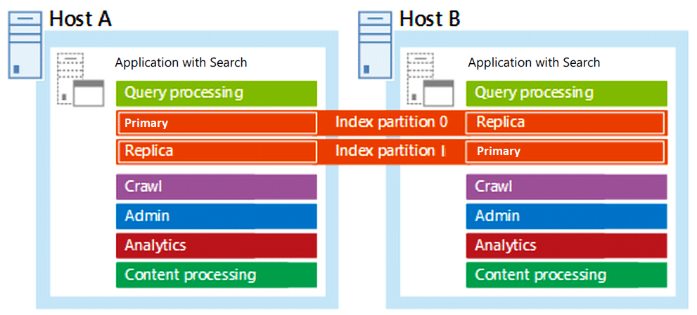
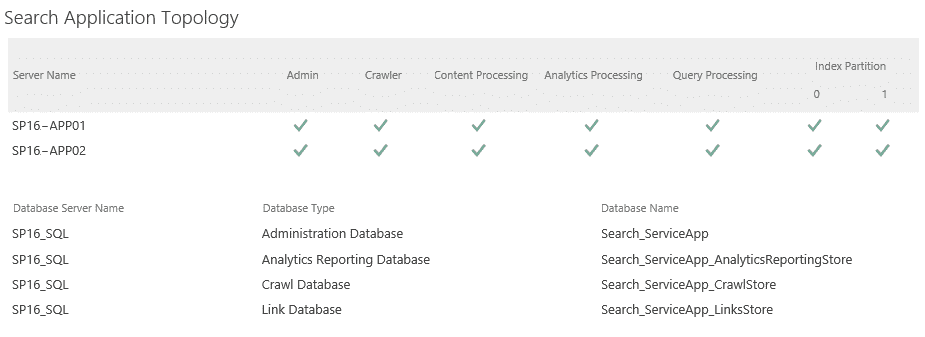
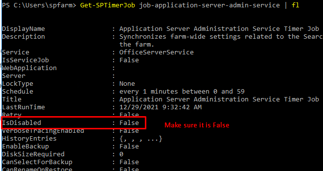
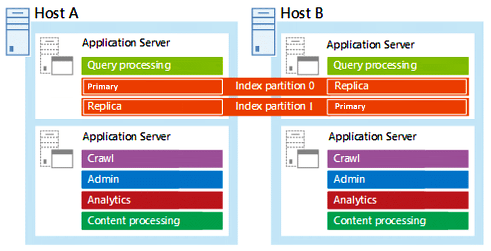

# Table of Contents
- [Desc](#desc)
- [Solution](#solution)
- [Fix](#fix)
- [Scale-out](#scale-out)
- [Reference](#reference)

## Desc
There is no user interface to configure the Search topology from SharePoint Central Admin, while sometimes, we want to add Redundancy, Performance, and Reliability to the search application by splitting the six search components (Admin, Crawl, Content Processing, Indexing, Analytics, and Query Processing) among multiple servers. Also, we will configure two index partitions to ensure both servers have a replica of the search index.

Here is the proposed Farm search topology at a high level:

## Solution
- Creating a managed account and application pool for search service application.
- Creating SharePoint Search Service Application & Proxy
- Starting Search service instance on all servers participating in search topology
- Creating a Search Topology and adding Search components, and then Activating the search topology

Create folders for Index Location & Replica Location (as in variables: $PrimaryIndexLocation and $ReplicaIndexLocation) on all servers which are hosting search topology index components prior to running the main script!

    #Set the primary and replica index locations
    $PrimaryIndexLocation = "D:\SearchIndex"
    $ReplicaIndexLocation = "E:\SearchIndexReplica"
    
    #Prepare Index Locations
    Remove-Item -Recurse -Force -LiteralPath $PrimaryIndexLocation -ErrorAction SilentlyContinue
    MKDIR -Path $PrimaryIndexLocation -Force
    Remove-Item -Recurse -Force -LiteralPath $ReplicaIndexLocation -ErrorAction SilentlyContinue
    MKDIR -Path $ReplicaIndexLocation -Force

PowerShell Script to Configure Search Service Application in SharePoint 2016

    Add-PSSnapin Microsoft.SharePoint.PowerShell -ErrorAction SilentlyContinue
    
    #Region Config_Parameters
    #Settings for Search Service Application
    $SearchServiceApplicationName = "Search Service Application"
    $SearchServiceApplicationProxyName = "Search Service Application Proxy"
    $SearchAppPoolAccount = "Crescent\SP16_Services"
    $SearchDatabaseServer = "SP16_SQL"
    $SearchServiceApplicationDatabase = "Crescent_Search_ServiceApp"
    $SearchAppPoolName = "Service Application App Pool"
    
    #Farm Server topology: App with Search role: 2
    $SearchAppServer1 = "SP16-APPSrv01"
    $SearchAppServer2 = "SP16-APPSrv02"
    
    #Set the primary and replica index locations
    $PrimaryIndexLocation = "D:\SearchIndex"
    $ReplicaIndexLocation = "E:\SearchIndexReplica"
    #EndRegion
    
    
    #*** Step 1: Create Managed Account, Service Application Pool for Search Service Application **** 
    #Check if Managed account is registered already
    Write-Host -ForegroundColor Yellow "Checking if the Managed Accounts already exists..."
    $SearchAppPoolAccount = Get-SPManagedAccount -Identity $SearchAppPoolAccount -ErrorAction SilentlyContinue
    If ($SearchAppPoolAccount -eq $null)
    {
        Write-Host "Please Enter the password for the Service Account..."
        $AppPoolCredentials = Get-Credential $SearchAppPoolAccount
        $SearchAppPoolAccount = New-SPManagedAccount -Credential $AppPoolCredentials
        write-host "Managed Account has been Created!" -ForegroundColor Green
    }
    
    #Try to Get the existing Application Pool
    Write-Host -ForegroundColor Yellow "Checking if the App Pool already exists..."
    $SearchServiceAppPool = Get-SPServiceApplicationPool -Identity $SearchAppPoolName -ErrorAction SilentlyContinue
    #If Application pool Doesn't exists, Create it
    if ($SearchServiceAppPool -eq $Null)
    { 
        $SearchServiceAppPool = New-SPServiceApplicationPool -Name $SearchAppPoolName -Account $SearchAppPoolAccount
        write-host "Created New Service Application Pool!" -ForegroundColor Green
    }
    
    #*** Step 2: Start Search Service Instances on required servers ***
    Write-host "Starting Service Instances..." -ForegroundColor Green
    #Search App Server 1
    $SearchAppInstance1 = Get-SPEnterpriseSearchServiceInstance $SearchAppServer1
    if(-not($SearchAppInstance1.Status -eq "Online"))
    {
        Write-Host -ForegroundColor Yellow "Starting Search Service instance on $SearchAppServer1..." -NoNewline
        $SearchAppInstance1 | Start-SPEnterpriseSearchServiceInstance
        while ($SearchAppInstance1.Status -ne "Online")
        {
            Write-Host -ForegroundColor Green "." -NoNewline
            Start-Sleep -Seconds 5
            $SearchAppInstance1 = Get-SPEnterpriseSearchServiceInstance $SearchAppServer1
        }
        Write-Host -ForegroundColor Green "Started Search Service instance on $SearchAppServer1"
    }
    Start-SPEnterpriseSearchQueryAndSiteSettingsServiceInstance $SearchAppServer1 -ErrorAction SilentlyContinue
    
    #Search App Server 2
    $SearchAppInstance2 = Get-SPEnterpriseSearchServiceInstance $SearchAppServer2
    if(-not($SearchAppInstance2.Status -eq "Online"))
    {
        Write-Host -ForegroundColor Yellow "Starting Search Service instance on $SearchAppServer2..." -NoNewline
        $SearchAppInstance2 | Start-SPEnterpriseSearchServiceInstance
        while ($SearchAppInstance2.Status -ne "Online")
        {
            Write-Host -ForegroundColor Green "." -NoNewline
            Start-Sleep -Seconds 5
            $SearchAppInstance2 = Get-SPEnterpriseSearchServiceInstance $SearchAppServer2
        }
        Write-Host -ForegroundColor Green "Started Search Service instance on $SearchAppServer2"
    }
    Start-SPEnterpriseSearchQueryAndSiteSettingsServiceInstance $SearchAppServer2 -ErrorAction SilentlyContinue
    
    #*** Step 3: Create Search Service Application and proxy**** 
    Write-host "Creating Search Service Application..." -ForegroundColor Yellow
    # Get the Search Service Application
    $SearchServiceApplication = Get-SPEnterpriseSearchServiceApplication -Identity $SearchServiceApplicationName -ErrorAction SilentlyContinue
    # Create the Search Service Application, If it doesn't exist! 
    if(!$SearchServiceApplication)
    {
        $SearchServiceApplication = New-SPEnterpriseSearchServiceApplication -Name $SearchServiceApplicationName -ApplicationPool $SearchServiceAppPool -DatabaseServer $SearchDatabaseServer -DatabaseName $SearchServiceApplicationDatabase
        write-host "Created New Search Service Application" -ForegroundColor Green
    }
    
    #Get the Search Service Application Proxy
    $SearchServiceAppProxy = Get-SPEnterpriseSearchServiceApplicationProxy -Identity $SearchServiceApplicationProxyName -ErrorAction SilentlyContinue
    # Create the Proxy If it doesn't exist! 
    if(!$SearchServiceAppProxy)
    {
        $SearchServiceAppProxy = New-SPEnterpriseSearchServiceApplicationProxy -Name $SearchServiceApplicationProxyName -SearchApplication $SearchServiceApplication
        write-host "Created New Search Service Application Proxy" -ForegroundColor Green
    }
    
    #*** Step 4: Create New Search Topology and add components to it
    Write-Host -ForegroundColor Yellow "Creating Search Service Topology..."
    # Create New Search Topology 
    $SearchTopology =  New-SPEnterpriseSearchTopology -SearchApplication $SearchServiceApplication
    
    #Admin Component: App 01 and 02
    New-SPEnterpriseSearchAdminComponent -SearchTopology $SearchTopology -SearchServiceInstance $SearchAppInstance1
    New-SPEnterpriseSearchAdminComponent -SearchTopology $SearchTopology -SearchServiceInstance $SearchAppInstance2
    
    #Content Processing: App 01 and 02
    New-SPEnterpriseSearchContentProcessingComponent -SearchTopology $SearchTopology -SearchServiceInstance $SearchAppInstance1
    New-SPEnterpriseSearchContentProcessingComponent -SearchTopology $SearchTopology -SearchServiceInstance $SearchAppInstance2
    
    #Analytics processing: App01 and 02
    New-SPEnterpriseSearchAnalyticsProcessingComponent -SearchTopology $SearchTopology -SearchServiceInstance $SearchAppInstance1
    New-SPEnterpriseSearchAnalyticsProcessingComponent -SearchTopology $SearchTopology -SearchServiceInstance $SearchAppInstance2
    
    #Crawl components: App 01 and 02
    New-SPEnterpriseSearchCrawlComponent -SearchTopology $SearchTopology -SearchServiceInstance $SearchAppInstance1
    New-SPEnterpriseSearchCrawlComponent -SearchTopology $SearchTopology -SearchServiceInstance $SearchAppInstance2
    
    #Query processing: App 01 and 02
    New-SPEnterpriseSearchQueryProcessingComponent -SearchTopology $SearchTopology -SearchServiceInstance $SearchAppInstance1
    New-SPEnterpriseSearchQueryProcessingComponent -SearchTopology $SearchTopology -SearchServiceInstance $SearchAppInstance2
    
    #Create Index Components: App 01 and 02
    #Two index partitions and replicas for each partition
    New-SPEnterpriseSearchIndexComponent -SearchTopology $SearchTopology -SearchServiceInstance $SearchAppInstance1 -RootDirectory $PrimaryIndexLocation -IndexPartition 0
    New-SPEnterpriseSearchIndexComponent -SearchTopology $SearchTopology -SearchServiceInstance $SearchAppInstance2 -RootDirectory $ReplicaIndexLocation -IndexPartition 0
    New-SPEnterpriseSearchIndexComponent -SearchTopology $SearchTopology -SearchServiceInstance $SearchAppInstance2 -RootDirectory $PrimaryIndexLocation -IndexPartition 1
    New-SPEnterpriseSearchIndexComponent -SearchTopology $SearchTopology -SearchServiceInstance $SearchAppInstance1 -RootDirectory $ReplicaIndexLocation -IndexPartition 1
    
    #Activate the Topology for Search Service
    $SearchTopology.Activate() # Or Use: Set-SPEnterpriseSearchTopology -Identity $SearchTopology
    
    #Remove all inactive topologies
    $InactiveTopologies = Get-SPEnterpriseSearchTopology -SearchApplication $SearchServiceApplication | Where {$_.State -ne "Active"}
    $InactiveTopologies | Remove-SPEnterpriseSearchTopology -Confirm:$false
    
    Write-Host -ForegroundColor Green "Search Service Application has been created. Please start a Full Crawl!"

## Fix
If you encounter error as below:

"The Search Service is not able to connect to the machine that host Administration components, Verify the administration component "GUID" in Search Application is in a good state and try Again"

- Run **Get-SPTimerJob job-application-server-admin-service | fl** to check if the Search admin timer job was disabled:

  

- If disabled, enable it using: Enable-SPTimerJob job-application-server-admin-service
- Restart SharePoint Timer Service
- IISRESET

If issue stills, you need to delete the previous created search application and try to create a new one.

## Scale-out
E.g.

Modify the above script as following.

    #Farm Server topology: App+Search: 4
    $SearchAppServer1 = "Cre-SP16App01"
    $SearchAppServer2 = "Cre-SP16App02"
    $SearchAppServer3 = "Cre-SP16App03"
    $SearchAppServer4 = "Cre-SP16App04"

Start Service instances on app servers 3 & 4 :

    #Search App Server 3
    $SearchAppInstance3 = Get-SPEnterpriseSearchServiceInstance $SearchAppServer3
    if(-not($SearchAppInstance3.Status -eq "Online"))
    {
        Write-Host -ForegroundColor Yellow "Starting Search Service instance on $SearchAppServer3..." -NoNewline
        $SearchAppInstance3 | Start-SPEnterpriseSearchServiceInstance
        while ($SearchAppInstance3.Status -ne "Online")
        {
            Write-Host -ForegroundColor Green "." -NoNewline
            Start-Sleep -Seconds 5
            $SearchAppInstance3 = Get-SPEnterpriseSearchServiceInstance $SearchAppServer3
        }
        Write-Host -ForegroundColor Green "Started Search Service instance on $SearchAppServer3"
    }
    Start-SPEnterpriseSearchQueryAndSiteSettingsServiceInstance $SearchAppServer3 -ErrorAction SilentlyContinue

    #Search App Server 4
    $SearchAppInstance4 = Get-SPEnterpriseSearchServiceInstance $SearchAppServer4
    if(-not($SearchAppInstance4.Status -eq "Online"))
    {
        Write-Host -ForegroundColor Yellow "Starting Search Service instance on $SearchAppServer4..." -NoNewline
        $SearchAppInstance4 | Start-SPEnterpriseSearchServiceInstance
        while ($SearchAppInstance4.Status -ne "Online")
        {
            Write-Host -ForegroundColor Green "." -NoNewline
            Start-Sleep -Seconds 5
            $SearchAppInstance4 = Get-SPEnterpriseSearchServiceInstance $SearchAppServer4
        }
        Write-Host -ForegroundColor Green "Started Search Service instance on $SearchAppServer4"
    }
    Start-SPEnterpriseSearchQueryAndSiteSettingsServiceInstance $SearchAppServer4 -ErrorAction SilentlyContinue 

On creating Search topology: Assign Query and Index Roles to App Servers 3 and 4

    #Query processing: App 03 and 04
    New-SPEnterpriseSearchQueryProcessingComponent -SearchTopology $SearchTopology -SearchServiceInstance $SearchAppInstance3
    New-SPEnterpriseSearchQueryProcessingComponent -SearchTopology $SearchTopology -SearchServiceInstance $SearchAppInstance4
    
    #Create Index Components: App 03 and 04
    #Two index partitions and replicas for each partition
    New-SPEnterpriseSearchIndexComponent -SearchTopology $SearchTopology -SearchServiceInstance $SearchAppInstance3 -RootDirectory $PrimaryIndexLocation -IndexPartition 0
    New-SPEnterpriseSearchIndexComponent -SearchTopology $SearchTopology -SearchServiceInstance $SearchAppInstance4 -RootDirectory $ReplicaIndexLocation -IndexPartition 0
    New-SPEnterpriseSearchIndexComponent -SearchTopology $SearchTopology -SearchServiceInstance $SearchAppInstance4 -RootDirectory $PrimaryIndexLocation -IndexPartition 1
    New-SPEnterpriseSearchIndexComponent -SearchTopology $SearchTopology -SearchServiceInstance $SearchAppInstance3 -RootDirectory $ReplicaIndexLocation -IndexPartition 1

## Reference
https://www.sharepointdiary.com/2017/10/create-search-service-application-in-sharepoint-2016-using-powershell.html