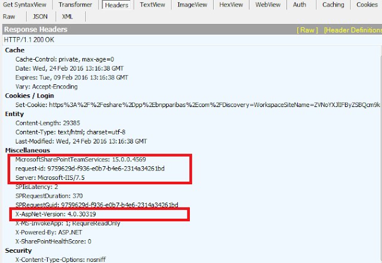
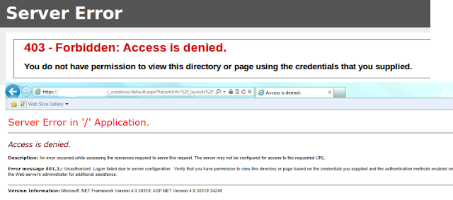

## Background
The sps exposes the IIS and SharePoint version, which can then be used to research security vulnerabilities in those particular versions.

## Solution
- ### Removing IIS Headers for SharePoint and ASP.Net
    1. Open IIS Manager.
    2. At the server level and the site level you will find 'HTTP Response Headers'.
    3. On the HTTP Response Headers page, select the header and click remove.

Remove SharePoint version number

    <httpProtocol>
       <customHeaders>
         <add name="X-Content-Type-Options" value="nosniff" />
         <add name="X-MS-InvokeApp" value="1; RequireReadOnly" />
         <remove name="MicrosoftSharePointTeamServices"/>
         <remove name="X-Powered-By" />
       </customHeaders>
     </httpProtocol>
 
Remove ASP.NET version

    <system.web>
       <httpRuntime maxRequestLength="2097151" executionTimeout="3600" enableVersionHeader="False" />
     </system.web>

- ### Using custom error pages to mask the underlying technology being used

Create your custom error page, which can be a simple html page to start with or something more customised for your needs.
Save your custom error pages to the below location on your SharePoint servers:
C:\Program Files\Common Files\Microsoft Shared\Web Server Extensions\15\TEMPLATE\LAYOUTS\1033
 
### Set the SharePoint error pages on non publishing sites:

    $webApp = Get-SPWebApplication https://testsite.com
    $webApp.FileNotFoundPage = “CustomError_Page.html”
    $webApp.Update()
    
    $webApp = Get-SPWebApplication https://testsite.com
    $webApp.UpdateMappedPage([Microsoft.SharePoint.Administration.SPWebApplication+SPCustomPage]::Error,"/_layouts/1033/CustomError_Page.html")
    $webApp.Update()

### configure the publishing sites
    $site = get-spsite 'https://testsite.com'
    $site.FileNotFoundUrl = ""
If you set the site level error page to a blank value "", then the web app level setting we just set will override this and the site will be consistent with the other non publishing sites.

## Reference
https://sharepoint-mattharmon.blogspot.com/2016/02/security-hardening-your-sharepoint.html