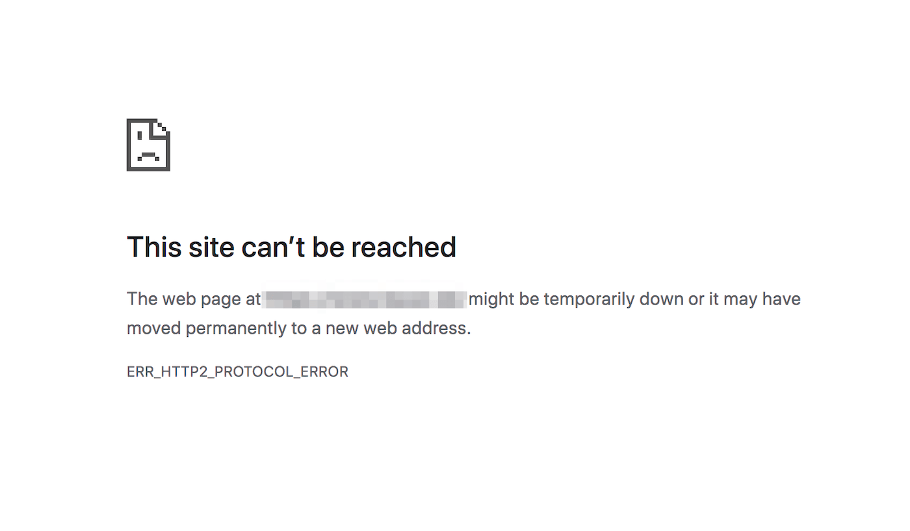

## Desc
### Sometimes, when we acess SPS 2019, we may got ERR_HTTP2_PROTOCOL_ERROR.

#### In general, the err_http2_protocol_error can appear because of issues with the browser, network, or conflicts with third-party software. Usually, this happens when HTTP/2 is outdated or not supported at all. 
#### For an HTTP/2 protocol error, something interrupts the communication between the HTTP application layer and a user’s device. 

## Fix
### This issue can be fixed by modifying the following registry key.
1. Navigate to the registry key HKEY_LOCAL_MACHINE\System\CurrentControlSet\Services\HTTP\Parameters.
2. Add 2 new REG_DWORD values, EnableHttp2Tls and EnableHttp2Cleartext, to this registry key.
3. Set both values to 0.
4. Reboot the server.