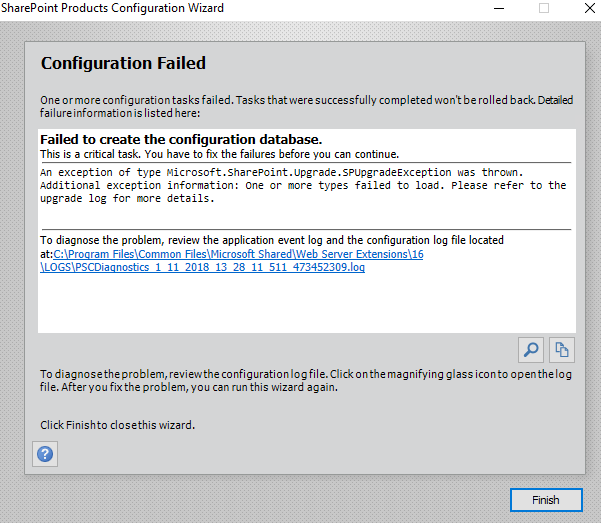
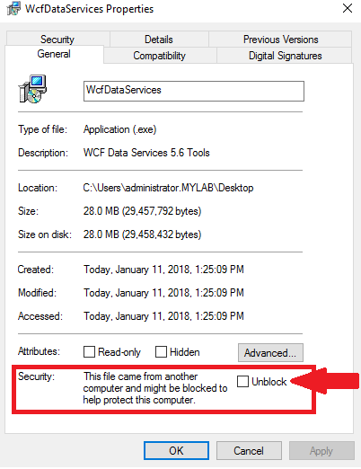
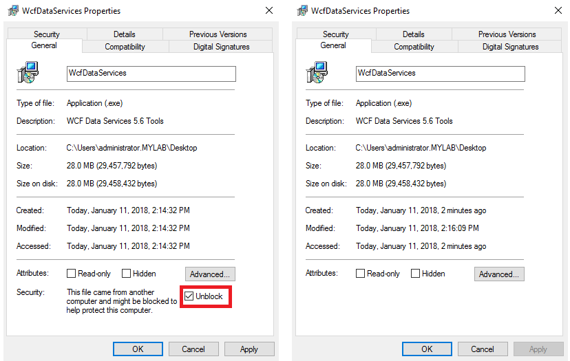
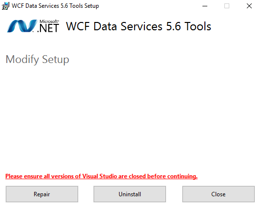
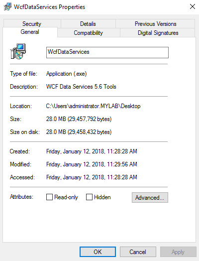
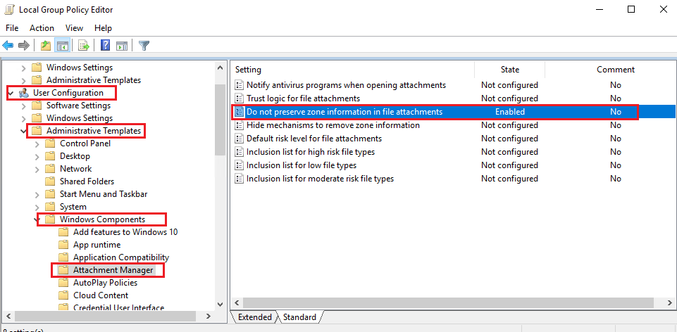

# Table of Contents
- [Desc](#desc)
- [Casue](#casue)
- [Fix](#fix)
- [Note](#note)
  - [Why?](#why)
  - [Fix](#fix-1)
- [Reference](#reference)

## Desc
SharePoint fails to run production configuration wizard for a new farm

PSCDiagnostics log sample:

    ERR Exception: Microsoft.SharePoint.Upgrade.SPUpgradeException: One or more types failed to load. Please refer to the upgrade log for more details.
    at Microsoft.SharePoint.Upgrade.SPActionSequence.LoadUpgradeActions()
    at Microsoft.SharePoint.Upgrade.SPActionSequence.get_Actions()
    at Microsoft.SharePoint.Upgrade.SPActionSequence.get_ActionsInternal()
    at Microsoft.SharePoint.Upgrade.SPUtility.GetLatestTargetSchemaVersionBeforeMajorVersion(Type typeActionSequence, Int32 majorVer)
    at Microsoft.SharePoint.Upgrade.SPSiteSequence.get_PreviousTargetSchemaVersion()
    at Microsoft.SharePoint.Upgrade.SPUpgradeSession.PopulateSequencesTable(StringBuilder sqlstr, Boolean siteSequence)
    at Microsoft.SharePoint.Upgrade.SPUpgradeSession.ConstructSiteNeedsUpgradeQuery(Guid siteId)
    at Microsoft.SharePoint.Upgrade.SPContentDatabaseSequence.GetSiteNeedsUpgrade(SPUpgradeSession session, SPContentDatabase database, Dictionary`2& dictSitesNeedUpgrade, Dictionary`2& dictSitesNeedFeatureUpgrade)
    at Microsoft.SharePoint.Upgrade.SPContentDatabaseSequence.AddNextLevelObjects()
    at Microsoft.SharePoint.Upgrade.SPHierarchyManager.Grow(SPTree`1 root, Boolean bRecursing, SPDelegateManager delegateManager)
    at Microsoft.SharePoint.Upgrade.SPHierarchyManager.Grow(SPTree`1 root, SPDelegateManager delegateManager)
    at Microsoft.SharePoint.Upgrade.SPUpgradeSession.NeedsUpgrade(Object o, Boolean bRecurse)
    at Microsoft.SharePoint.Upgrade.SPUpgradeSession.ReflexiveNeedsUpgrade(Object o, Boolean bRecurse)
    at Microsoft.SharePoint.Upgrade.SPUpgradeSession.NeedsUpgrade(Object o, Boolean bRecurse)
    at Microsoft.SharePoint.Upgrade.SPUpgradeSession.ReflexiveNeedsUpgrade(Object o, Boolean bRecurse)
    at Microsoft.SharePoint.Upgrade.SPUpgradeSession.NeedsUpgrade(Object o, Boolean bRecurse)
    at Microsoft.SharePoint.Upgrade.SPUpgradeSession.ReflexiveNeedsUpgrade(Object o, Boolean bRecurse)
    at Microsoft.SharePoint.Upgrade.SPUpgradeSession.NeedsUpgrade(Object o, Boolean bRecurse)
    at Microsoft.SharePoint.Upgrade.SPUpgradeSession.ReflexiveNeedsUpgrade(Object o, Boolean bRecurse)
    at Microsoft.SharePoint.Upgrade.SPUpgradeSession.NeedsUpgrade(Object o, Boolean bRecurse)
    at Microsoft.SharePoint.Administration.SPServerProductInfo.DetectLocalUpgradeStatus()
    at Microsoft.SharePoint.Administration.SPServerProductInfo.DetectLocalProductVersions(SPProductVersions prodVer)
    at Microsoft.SharePoint.Administration.SPServerProductInfo.UpdateProductInfoInDatabase(Guid serverGuid)
    at Microsoft.SharePoint.Administration.SPFarm.Join(Boolean skipRegisterAsDistributedCacheHost, Nullable`1 serverRole)
    at Microsoft.SharePoint.PostSetupConfiguration.ConfigurationDatabaseTask.CreateOrConnectConfigDb()
    at Microsoft.SharePoint.PostSetupConfiguration.ConfigurationDatabaseTask.Run()
    at Microsoft.SharePoint.PostSetupConfiguration.TaskThread.ExecuteTask()

## Casue
This issue can occur while deloy SPS via offline method. If you download and install all the prerequisite software manually. If you are experiencing the error, "One or more types failed to load" , while creating a new SharePoint Farm, it's most likely caused by the installer executable of "**WCF Data Services 5.6 Tools**" being in a "blocked" state while it was installed.

The "**WCF Data Services 5.6 Tools**" will install "succeed' but will not be installed properly.

## Fix
1. Make sure you have already unblocked the installer.

2. Re-run the installer and choose repair option.

3. Re-run SharePoint Configuration Wizard.

## Note
It may be the same issue without the installer appearing to be "blocked".
The following image does not show the installer package being in a "blocked" state.

But you will encounter the same issue.
### Why?
This condition can occur of your system is configured with the "Do not preserve zone information in file attachments" policy enabled.

Policy:

    User Configuration > Administrative Templates > Windows Components > Attachment Manager > Do not preserve zone information in file attachments = Enabled

### Fix
1. Disable the "Do not preserve zone information in file attachments" policy and reboot.
2. Re-run "**WCF Data Services 5.6 Tools**" manually and choose the repair option, if applicable.

## Reference
https://techcommunity.microsoft.com/t5/microsoft-sharepoint-blog/sharepoint-fails-to-create-configuration-database-for-a-new-farm/ba-p/309056
https://www.linkedin.com/pulse/resolvedmicrosoftsharepointupgradespupgradeexception-syed-sabhi-zaidi