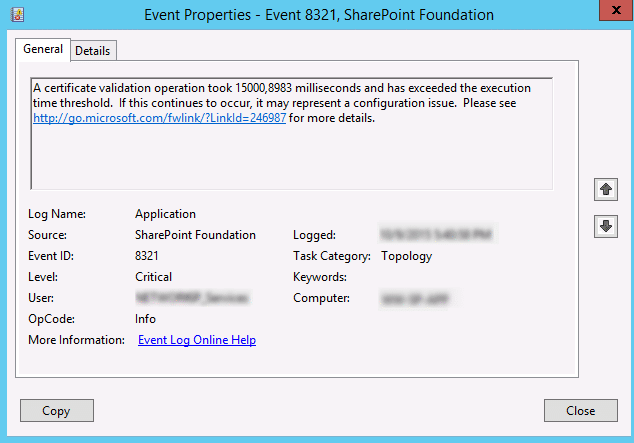
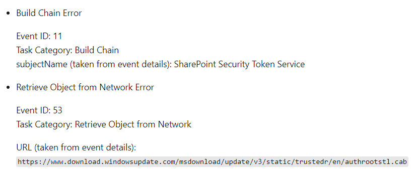
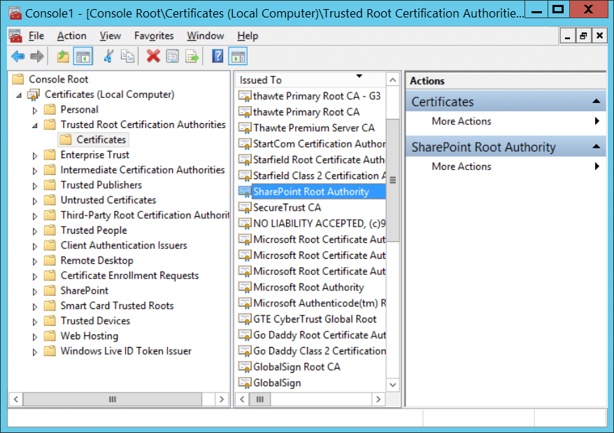
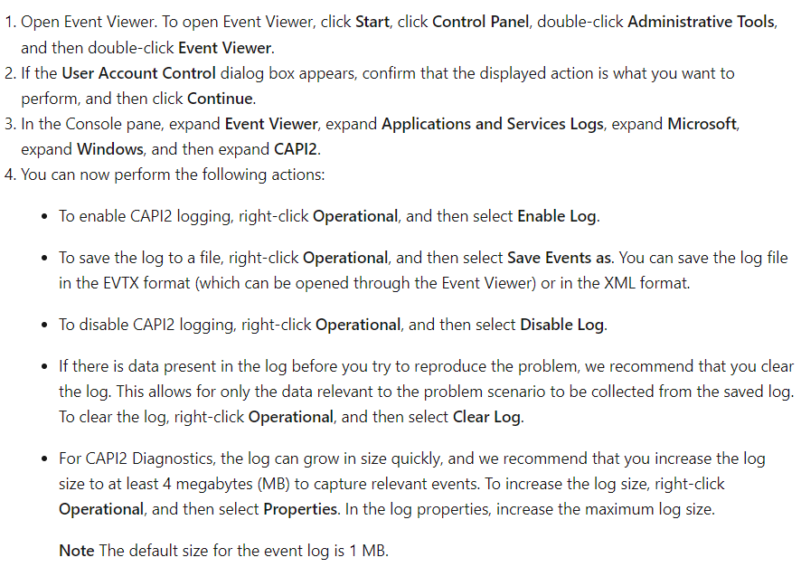
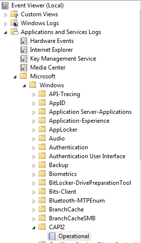

# Table of Contents
- [Desc](#desc)
- [Cause](#cause)
- [Official explanation](#official-explanation)
- [Solution #1](#solution-1)
- [Solution #2](#solution-2)
- [More Info](#more-info)
  - [CAPI2?](#capi2)
  - [Enable and save the CAPI2 log from the Event Viewer UI](#enable-and-save-the-capi2-log-from-the-event-viewer-ui)
- [Reference](#reference)

## Desc
Once you check SPS ULS logs or event logs, you may find an event logged multiple times of "**Event ID 8321: A certificate validation operation took X milliseconds and has exceeded the execution time threshold**". And SharePoint pages were loading very slow!

## Cause
Typically, this error occurs on SharePoint servers that are running without internet connectivity. And in this situation, SharePoint Root Authority was not added to the Trusted Root Certification Authorities store (which is the default behavior!). Amazing!
## Official explanation
"SharePoint uses certificates to sign security tokens that are issued by the Security Token Service (STS). Like all certificates, the validity of the STS certificate has to be verified periodically to make sure that the certificate has not been revoked. By default, the root certificate in the chain is not added to the Trusted Root Certificate Authorities store of the SharePoint servers. Because of this, the certificate revocation list (CRL) check for the certificate is performed over the Internet. If the online CRL server cannot be reached from the SharePoint server for some reason, the operation times out after 15 seconds by default. Even if the CRL validation fails after 15 seconds, the SharePoint page may still be rendered after the delay."

Certificate validation failures can be tracked by enabling the CAPI2 event logging on the SharePoint server. 

## Solution #1
Manually install SharePoint Root Authority certificate to the Trusted Root Certification Authorities store. 

    $RootCertFile="C:\xxx\SPRootCert.cer"
    $SPRootCert = (Get-SPCertificateAuthority).RootCertificate
    $SProotCert.Export("Cer") | Set-Content $RootCertFile -Encoding Byte
    #Make sure the cert file has been created!
    Import-Certificate -FilePath $RootCertFile -CertStoreLocation Cert:\LocalMachine\Root

*Import the certificate in all SharePoint servers of the farm.*
## Solution #2
Disable the automatic update of root certificates on the SharePoint Servers. To do this, follow these steps:
1. Under the Computer Configuration node in the Local Group Policy Editor, double-click Policies.
2. Double-click Windows Settings, double-click Security Settings, and then double-click Public Key Policies.
3. In the Details pane, double-click Certificate Path Validation Settings.
4. Click the Network Retrieval tab, select the Define these policy settings check box, and then clear the Automatically update certificates in the Microsoft Root Certificate Program (recommended) check box.
5. Click OK, and then close the Local Group Policy Editor.
6. Run gpupdate/force to make the policy take effect immediately.

*Note With auto-update disabled, you may have to monitor for new releases, and then manually update the certificate trust as required.*

## More Info
### CAPI2?
The CryptoAPI 2.0 Diagnostics is a feature available on Microsoft Windows Server 2008 and later and Microsoft Windows Vista and later for client OS.
With this you can troubleshoot issues related to:

1. Certificate Chain Validation
2. Certificate Store Operations
3. Signature verification

### Enable and save the CAPI2 log from the Event Viewer UI

## Reference
https://www.sharepointdiary.com/2016/02/event-id-8321-certificate-validation-operation-took-x-milliseconds-exceeded-execution-time-threshold.html

https://learn.microsoft.com/en-us/sharepoint/troubleshoot/sites/site-slowness-because-of-sts-certificate-crl-checking

https://forums.ivanti.com/s/article/HOWTO-Enable-CAPI2-event-logging-for-investigating-certificate-related-issues?language=en_US