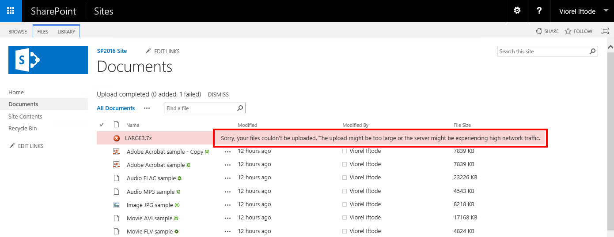
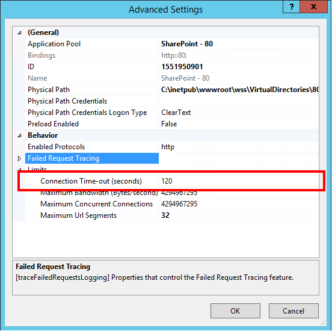
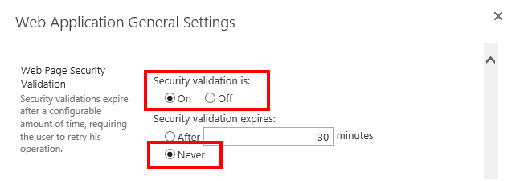
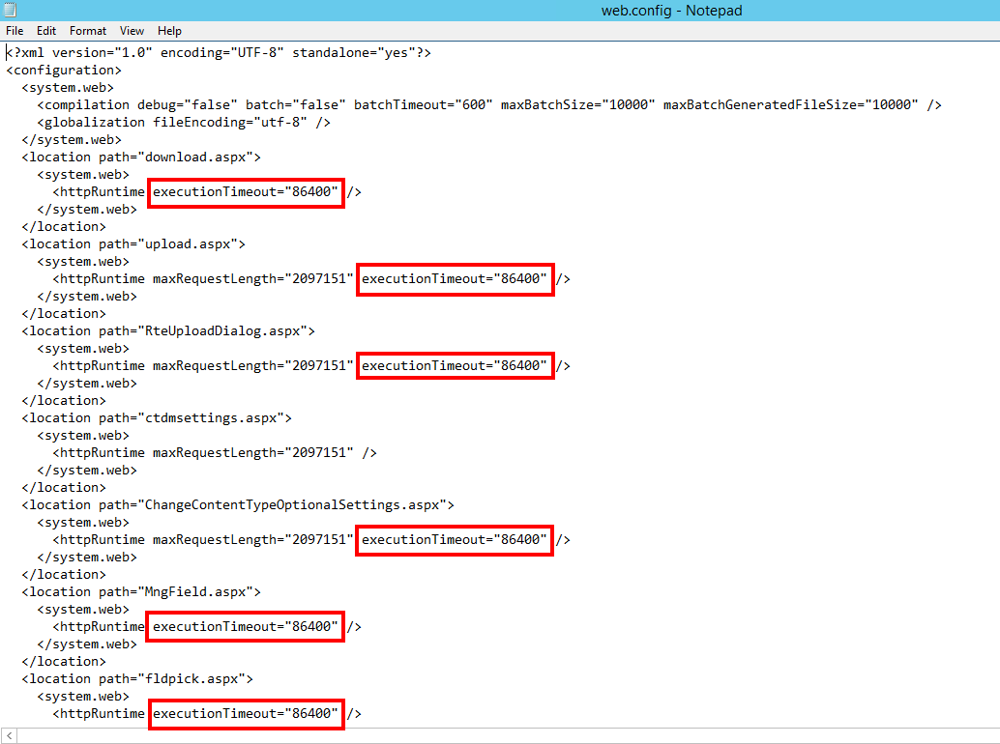
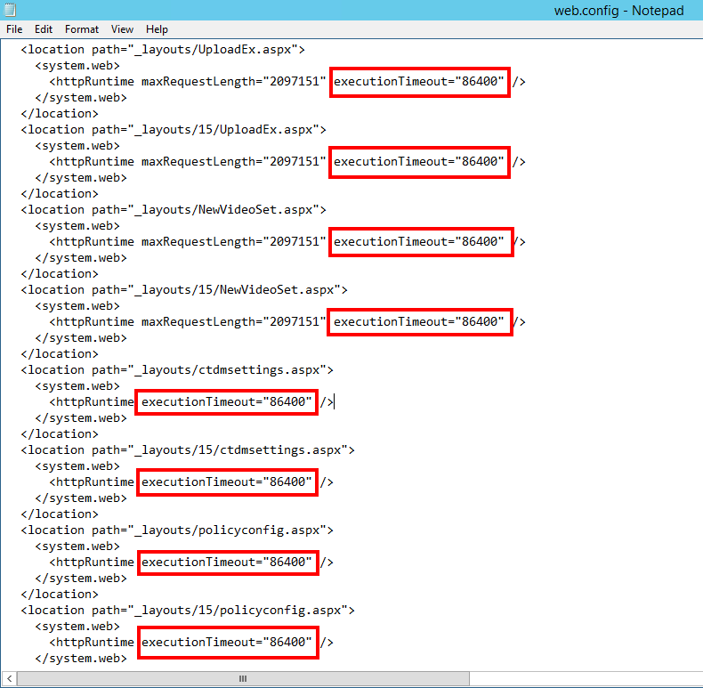
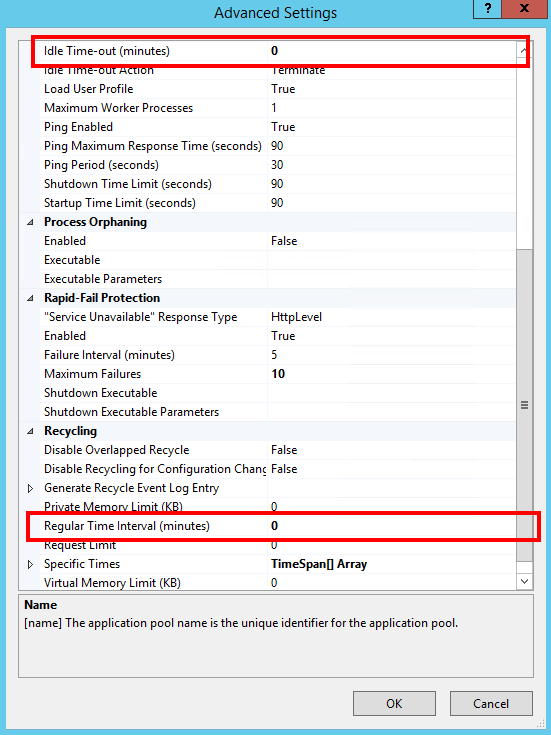
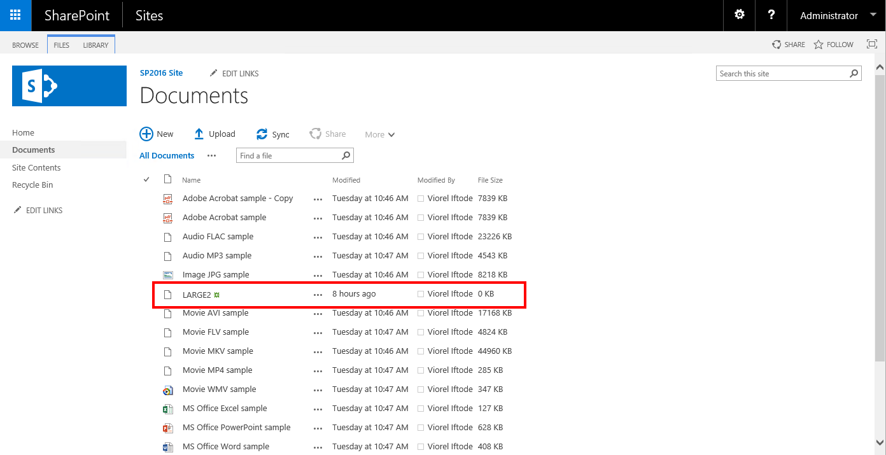
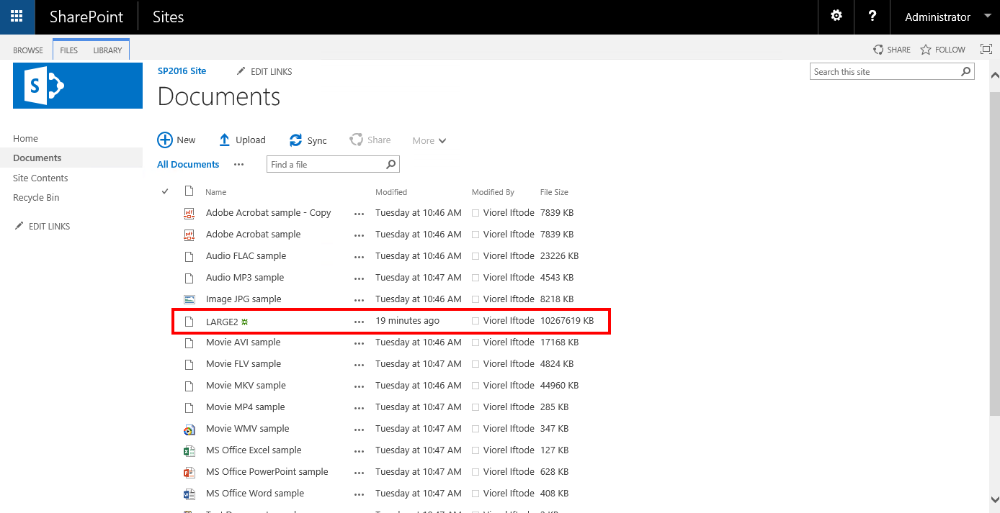

# Table of Contents
- [Desc](#desc)
- [Root Cause](#root-cause)
- [Fix](#fix)
- [Test Result](#test-result)
- [Note](#note)
- [Reference](#reference)

## Desc
Long running upload might fail due to large file upload over limited bandwidth.

*error => Sorry, your files couldn’t be uploaded. The upload might be too large or the server might be experiencing high network traffic.*

## Root Cause
Out of the box IIS & SharePoint are not tuned properly.

## Fix
1. Make sure the default 120 seconds connection time-out is not changed (IIS web site settings). Perform this for each Web Front End server part of your SharePoint farm. 
Start -> Administrative Tools -> Internet Information Services (IIS) Manager -> select the web site you want to configure -> click Advanced Settings… (right side of the console) -> Connection Time-out (seconds) -> set it to 120 -> click OK.

2. Adjust the Web Page Security Validation associated to you SharePoint Web Application.
Central Administration -> Manage web applications -> select the affected SharePoint Web Application -> click General Settings -> Web Page Security Validation -> Security validation expires: Never.

3. Adjust the C:\Program Files\Common Files\microsoft shared\Web Server Extensions\16\TEMPLATE\LAYOUTS\web.config settings. This controls the behavior of the drag & drop upload. Perform this for each Web Front End server part of your SharePoint farm.

4. Adjust the SharePoint Web Site web.config. Perform this for each Web Front End server part of your SharePoint farm.

5. Adjust the IIS App Pool Recycling and Process Model settings.
0 is the default setting for the IIS App Pool part of the SharePoint IIS Web Sites, but it is good to verify these values especially if you published your SharePoint farm through an ARR NLB.

## Test Result
While the file is in “uploading” state it is marked as having 0 KB. Please notice the modified time (8 hours) – that time was actually the time since the upload began.

After approximately 10 hours the upload successfully completed.

## Note
These settings will help you to configure the servers to accept long running uploads, but all these settings will not help if the network connectivity has interruptions.

## Reference
https://www.vioreliftode.com/index.php/how-to-make-sharepoint-2016-not-fail-long-running-uploads-large-files/