## 向量数据库概览
#### GPT 缺陷：GPT 模型如 GPT-3.5/4 存在输入端上下文（tokens）大小的限制，例如 gpt-3.5-turbo 模型限制为 4K tokens，约 3000 字。
#### 向量数据库崛起：作为解决 GPT 模型限制的方案之一，向量数据库通过将文本转换为向量并存储，使用户能够通过搜索最相似的向量来提高响应速度和降低成本。
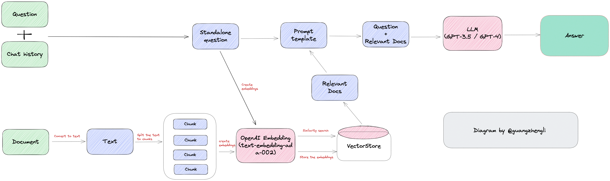

## Vector Embeddings
#### 特征和向量：向量数据库使用特征和向量来表示数据，以实现语义搜索。
单特征
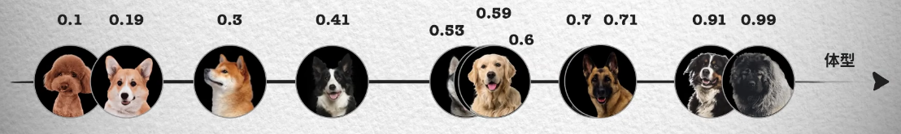
多特征
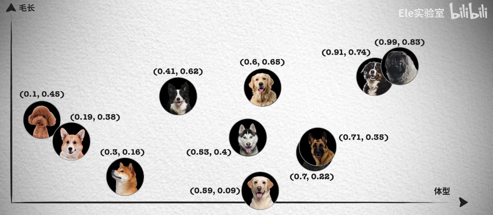
#### Vector Embedding：AI 模型生成的高维向量数据，代表数据的不同特征，如词汇、语法、语义等。

## 相似性搜索 (Similarity Search)
1. 聚类算法：如 K-Means，通过聚类中心将数据分组，减少搜索范围。
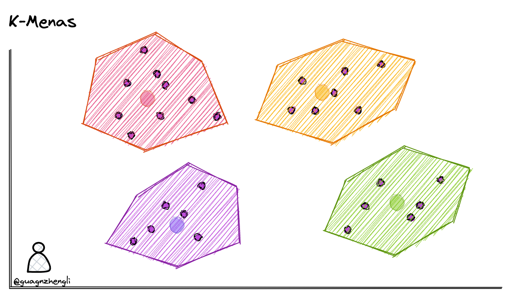
2. Faiss 算法：一种用于高效相似性搜索的算法，通过动态调整搜索范围提高搜索效率。
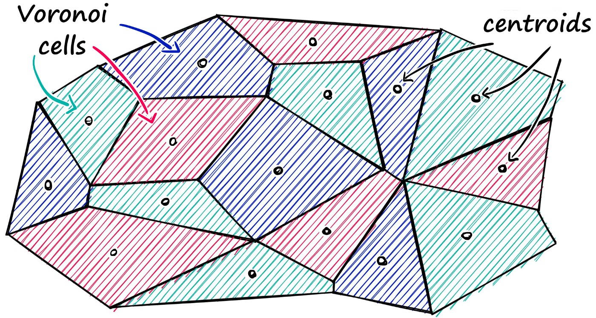
3. Product Quantization (PQ)：一种量化方法，减少内存占用并加快搜索速度，但可能会降低搜索质量。
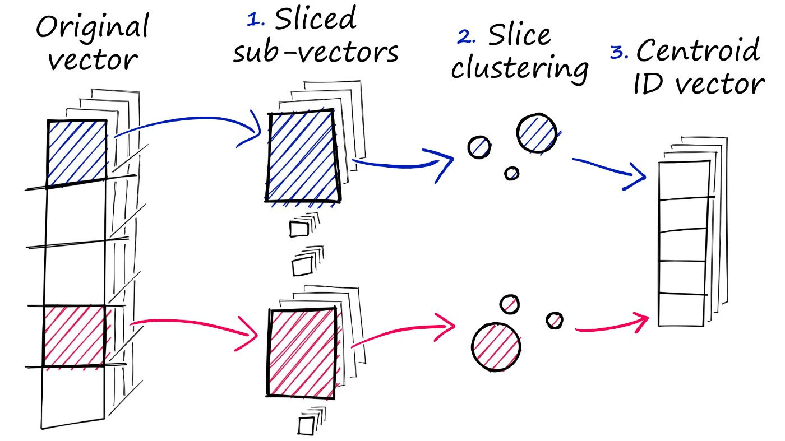
4. Hierarchical Navigable Small Worlds (HNSW)：构建图结构，通过分层搜索提高搜索质量和速度。
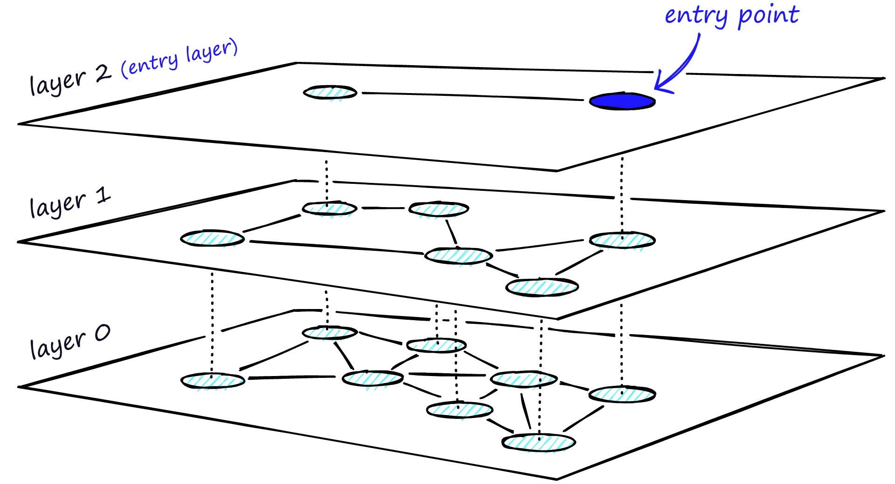
5. Locality Sensitive Hashing (LSH)：使用哈希函数将相似向量映射到同一“桶”中，快速提供近似结果。
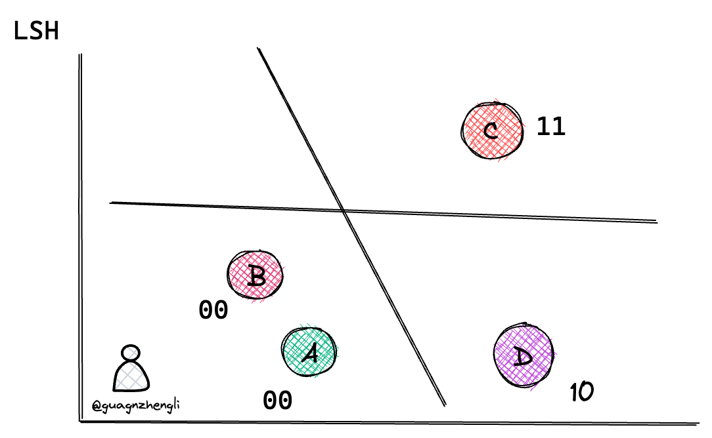

## 相似性测量 (Similarity Measurement)
1. 欧几里得距离 (Euclidean Distance)：反映向量的绝对距离。
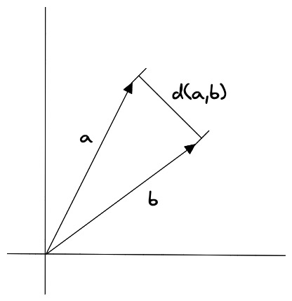
2. 余弦相似度 (Cosine Similarity)：关注向量的方向而非长度，适用于高维数据
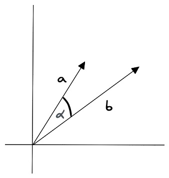
3. 点积相似度 (Dot product Similarity)：简单、快速，考虑向量长度和方向。
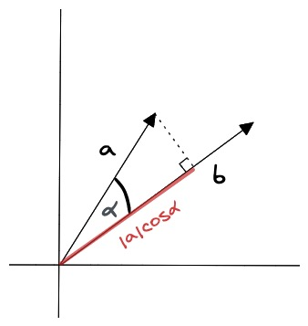
## 过滤 (Filtering)
#### 元数据索引：向量数据库维护向量索引和元数据索引，通过元数据过滤提高搜索效率。
#### 向量数据库通常维护两个索引：一个是向量索引，另一个是元数据索引。然后，在进行相似性搜索本身之前或之后执行元数据过滤
Pre-filtering：在向量搜索之前进行元数据过滤。虽然这可以帮助减少搜索空间，但也可能导致系统忽略与元数据筛选标准不匹配的相关结果。

Post-filtering：在向量搜索完成后进行元数据过滤。这可以确保考虑所有相关结果，在搜索完成后将不相关的结果进行筛选。
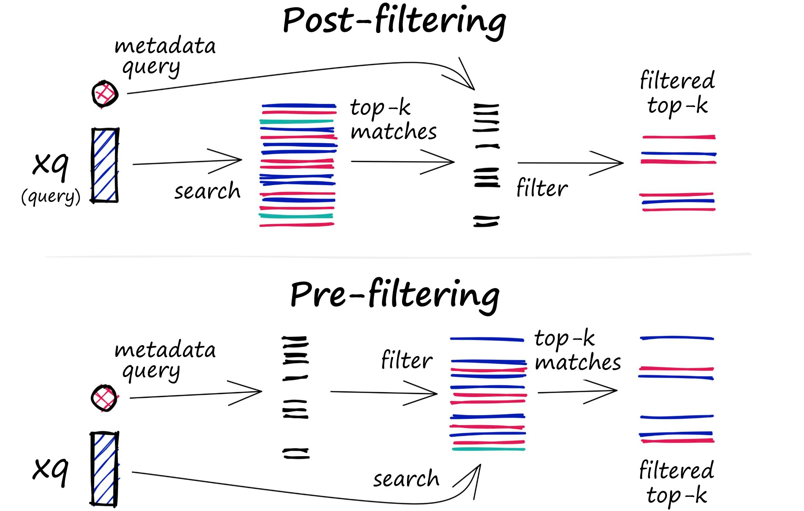
## 总结
#### 向量数据库是 AI 应用发展中的热门技术，尽管目前应用场景有限，但其在 AI 理解和维护长期记忆方面具有潜力。

## Reference
https://guangzhengli.com/blog/zh/vector-database/