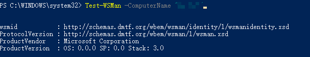

# Table of Contents
<!-- TOC -->

        - [Network is ok, remote desktop can connect.](#network-is-ok-remote-desktop-can-connect)
        - [WS management service is running.](#ws-management-service-is-running)
        - [Firewall is not blocked.](#firewall-is-not-blocked)
        - [Remote host has been add to the trusted list on client.](#remote-host-has-been-add-to-the-trusted-list-on-client)
        - [<Test-WSMan -ComputerName "RemoteHostName"> failed with same error message.](#test-wsman--computername-remotehostname-failed-with-same-error-message)
- [Fix](#fix)
- [Reference](#reference)

<!-- /TOC -->
"the operation on computer failed:the connection to the specified remote host was refused. verify that the ws-management service is running on the remote host and configured to listen for requests on the correct port and http url"

#### Network is ok, remote desktop can connect.
#### WS management service is running.
#### Firewall is not blocked.
#### Remote host has been add to the trusted list on client.
#### <Test-WSMan -ComputerName "RemoteHostName"> failed with same error message.

## Fix
Proxy issue!!!
I have set the proxy for powershell via the below cmd.

    netsh winhttp show proxy
But I forgot to unset it. So, what you need to do is unset the proxy via below cmd and everything will be ok.

    netsh winhttp reset proxy

## Reference
https://qianxu.run/2021/08/18/powershell-proxy/index.html