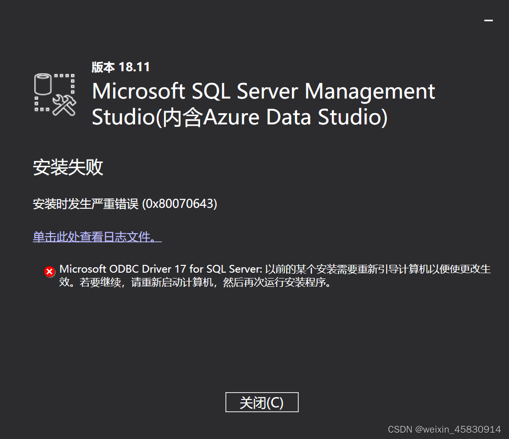
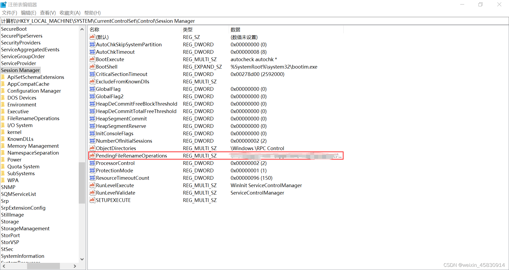

# Table of Contents
<!-- TOC -->

- [Desc](#desc)
- [Fix](#fix)
- [Reference](#reference)

<!-- /TOC -->
## Desc
Got an error while install SSMS. Restart not working.

## Fix
Remove *PendingFileRenameOperations* from registry.

## Reference
https://blog.csdn.net/weixin_45830914/article/details/123551230